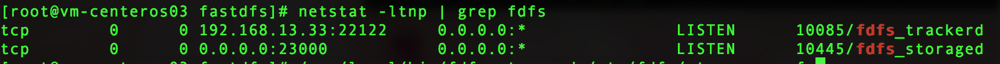
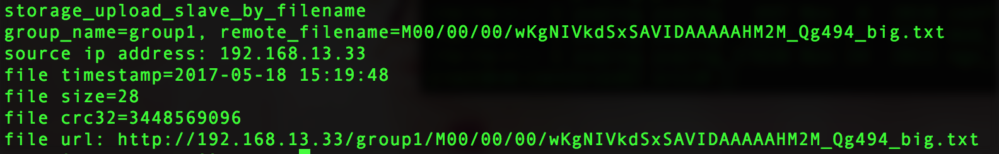
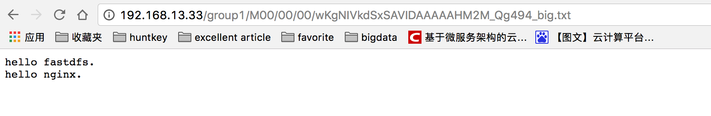

# FastDFS 

> Just demonstrate to how to use it.  
> You should dive into when using it for productive environment.

## 安装FastDFS (standalone)

### 环境以及软件准备

**ip: 192.168.13.33**  
**path: /tmp/fastdfs**  

```bash
# 下载FastDFS安装包及Nginx模块插件
mkdir /tmp/fastdfs
cd /tmp/fastdfs
git clone https://github.com/happyfish100/libfastcommon
git clone https://github.com/happyfish100/fastdfs
git clone https://github.com/happyfish100/fastdfs-nginx-module
wget "http://nginx.org/download/nginx-1.13.0.tar.gz"

# 安装依赖包
yum groupinstall -y "Development Tools"
yum install -y libevent* pcre-devel zlib-devel openssl openssl-devel
```

### FastDFS 安装

```bash
cd /tmp/fastdfs/libfastcommon
./make.sh
./make.sh install

cd /tmp/fastdfs/fastdfs
./make.sh
./make.sh install

# 配置 ip && paths.
cp /etc/fdfs/tracker.conf.sample /etc/fdfs/tracker.conf
vim /etc/fdfs/tracker.conf
bind_addr=192.168.13.33
base_path=/tmp/fastdfs

cp /etc/fdfs/storage.conf.sample /etc/fdfs/storage.conf
vim /etc/fdfs/storage.conf
base_path=/tmp/fastdfs
store_path0=/tmp/fastdfs
tracker_server=192.168.13.33:22122

```

### Nginx 安装

```bash
cd /tmp/fastdfs
tar -xvf nginx-1.13.0.tar.gz
cd nginx-1.13.0
mkdir -vp /var/cache/nginx/{client_temp,proxy_temp,fastcgi_temp,uwsgi_temp,scgi_temp}

# ./configure
./configure --prefix=/etc/nginx \
--sbin-path=/usr/sbin/nginx \
--conf-path=/etc/nginx/nginx.conf \
--error-log-path=/var/log/nginx/error.log \
--http-log-path=/var/log/nginx/access.log \
--pid-path=/var/run/nginx.pid \
--lock-path=/var/run/nginx.lock \
--http-client-body-temp-path=/var/cache/nginx/client_temp \
--http-proxy-temp-path=/var/cache/nginx/proxy_temp \
--http-fastcgi-temp-path=/var/cache/nginx/fastcgi_temp \
--http-uwsgi-temp-path=/var/cache/nginx/uwsgi_temp \
--http-scgi-temp-path=/var/cache/nginx/scgi_temp \
--user=nginx --group=nginx --with-http_ssl_module \
--with-http_realip_module --with-http_addition_module \
--with-http_sub_module --with-http_dav_module \
--with-http_flv_module --with-http_mp4_module \
--with-http_gunzip_module --with-http_gzip_static_module \
--with-http_random_index_module --with-http_secure_link_module \
--with-http_stub_status_module --with-mail --with-mail_ssl_module \
--with-file-aio --with-ipv6 \
--with-cc-opt='-O2 -g -pipe -Wp,-D_FORTIFY_SOURCE=2 \
-fexceptions -fstack-protector --param=ssp-buffer-size=4 \
-m64 -mtune=generic' \
--add-module=/tmp/fastdfs/fastdfs-nginx-module/src

make && make install

# 配置 nginx.conf
vim /etc/nginx/nginx.conf
# nginx访问fds的权限问题
user  root;
server {
    listen       80;
    server_name 192.168.13.33;
    location / {
        root   html;
        index  index.html index.htm;
    }

    location /group1/M00/ {
            alias /tmp/fastdfs/data;
            ngx_fastdfs_module;
    }
    error_page   500 502 503 504  /50x.html;
    location = /50x.html {
        root   html;
    }
}

# 添加nginx用户
useradd -M -s /sbin/nologin nginx

# 配置 
cp /tmp/fastdfs/fastdfs-nginx-module/src/mod_fastdfs.conf /etc/fdfs
cp /tmp/fastdfs/fastdfs/conf/http.conf /etc/fdfs/
cp /tmp/fastdfs/fastdfs/conf/mime.types /etc/fdfs/

vim /etc/fdfs/mod_fastdfs.conf
base_path=/tmp/fastdfs
tracker_server=192.168.13.33:22122
store_path0=/tmp/fastdfs
url_have_group_name=true

```

### 启动

```bash
# 启动 tracker
/usr/local/bin/fdfs_trackerd /etc/fdfs/tracker.conf

# 启动 storage
/usr/local/bin/fdfs_storaged /etc/fdfs/storage.conf

# 执行检查
netstat -ltnp | grep fdfs
```


```bash
# 启动 Nginx
/usr/sbin/nginx -c /etc/nginx/nginx.conf
```

### 测试

```bash

vim /etc/fdfs/client.conf
base_path=/tmp/fastdfs
tracker_server=192.168.13.33:22122
http.tracker_server_port=80

cd /tmp
vim hello-fdfs.txt
# 写入 hello fastdfs. hello nginx.

# 上传文件
/usr/local/bin/fdfs_test /etc/fdfs/storage.conf upload hello-fdfs.txt 
# 上传输出如下图：
```


```bash
# 在浏览器中使用 http://192.168.13.33/group1/M00/00/00/wKgNIVkdSxSAVIDAAAAAHM2M_Qg494_big.txt 进行访问
结果如下图：
```


至此，FastFDS (standalone)安装部署完毕

## 集群安装 (cluster)

> 以 192.168.13.32, 192.168.13.33 两台机器为集群机器  
> 每台机器都需要按照上述的步骤进行安装  

安装好单机版，并运行通过之后，停掉每台FastDFS上的相关进程，进行如下配置，两台机器配置一致

## 配置

```bash
vim /etc/fdfs/tracker.conf
use_storage_id = true

cp /tmp/fastdfs/fastdfs/conf/storage_ids.conf /etc/fdfs/
vim /etc/fdfs/storage_ids.conf
100001   group1  192.168.13.32
100002   group1  192.168.13.33

vim /etc/fdfs/storage.conf
tracker_server=192.168.13.32:22122
tracker_server=192.168.13.33:22122

vim /etc/fdfs/mod_fastdfs.conf
tracker_server=192.168.13.32:22122
tracker_server=192.168.13.33:22122 
 
vim /etc/fdfs/client.conf
tracker_server=192.168.13.32:22122
tracker_server=192.168.13.33:22122

# 启动 
/usr/local/bin/fdfs_trackerd /etc/fdfs/tracker.conf
/usr/local/bin/fdfs_storaged /etc/fdfs/storage.conf
/usr/sbin/nginx -c /etc/nginx/nginx.conf

# 测试这里就不赘述了
```

## Java 客户端使用

使用开源的客户端实现，和**SpringBoot**进行了整合

### 引用依赖包

```xml
<dependency>
    <groupId>org.springframework.boot</groupId>
    <artifactId>spring-boot-starter-web</artifactId>
</dependency>
<dependency>
    <groupId>com.github.tobato</groupId>
    <artifactId>fastdfs-client</artifactId>
    <version>1.25.3-RELEASE</version>
</dependency>
<dependency>
    <groupId>org.springframework.boot</groupId>
    <artifactId>spring-boot-starter-test</artifactId>
    <scope>test</scope>
</dependency>
```

### Java Client Config

```java
@Configuration
@Import(FdfsClientConfig.class)
public class ComponetImport {

}
```

### application.yml

```xml
fdfs:
  soTimeout: 1500
  connectTimeout: 600
  thumbImage:             #缩略图生成参数
    width: 150
    height: 150
  trackerList:            #TrackerList参数,支持多个
     - 192.168.13.32:22122
     - 192.168.13.33:22122
  pool:
    #从池中借出的对象的最大数目
    maxTotal: 100
    #获取连接时的最大等待毫秒数100
    maxWaitMillis: 1000
spring:
  jmx:
    enabled: false
```

### API概述

1. 文件上传、断点续传
2. 文件下载（落地、返回字节流）
3. 图片上传，并生成缩略图
4. 文件删除
5. 文件清空
6. 文件metadata修改
7. 文件信息查询

具体的使用方式请参考**单元测试代码**

## 参考

[https://github.com/happyfish100](https://github.com/happyfish100)  
[http://lee90.blog.51cto.com/10414478/1883174](http://lee90.blog.51cto.com/10414478/1883174)  
[https://github.com/tobato/FastDFS_Client](https://github.com/tobato/FastDFS_Client)

